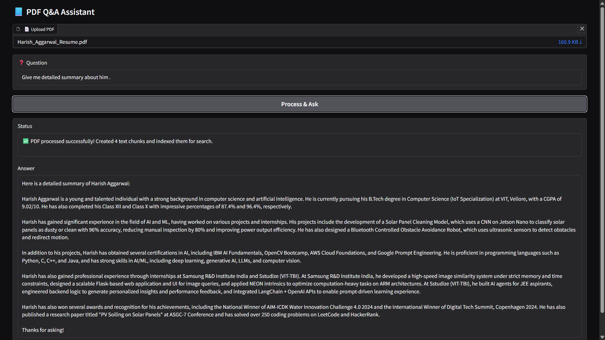

## PDF Q\&A Assistant

A Python application that lets you upload a PDF, processes its content using LLM-powered embeddings, and allows you to ask detailed questions about the document—all through a simple Gradio web interface.

---

### **Features**

- **PDF Upload \& Parsing:** Extracts text from uploaded PDF files.
- **Chunking \& Embeddings:** Splits text into manageable chunks and generates vector embeddings using HuggingFace models.
- **Vector Search:** Indexes the document with FAISS for efficient semantic search.
- **LLM-Powered Q\&A:** Uses LLaMA-3 (via Groq) to answer questions based on the PDF’s content.
- **Web Interface:** Clean, user-friendly Gradio UI for uploading, processing, and querying PDFs.
- **Error Handling:** Clear user feedback for missing files, failed processing, or missing API keys.

---

### **Demo Screenshot**

> 

---

## **Getting Started**

### **Prerequisites**

- Python 3.9+
- [Groq API Key](https://console.groq.com/) (for LLaMA-3)
- [HuggingFace Account](https://huggingface.co/) (for embeddings)
- [Docker](https://www.docker.com/) (optional, for containerized deployment)


### **Installation**

1. **Clone the repository:**

```bash
git clone https://github.com/HarishAggarwal/PDF-Powered-AI-Assistant
cd pdf-qa-assistant
```

2. **Install dependencies:**

```bash
pip install -r requirements.txt
```

3. **Set up environment variables:**
    - Create a `.env` file in the project root:

```
GROQ_API_KEY=your_groq_api_key_here
```


---

### **Usage**

1. **Run the app:**

```bash
python app.py
```

*(Replace `app.py` with the actual filename if different)*
2. **Open your browser:**
    - Visit `http://127.0.0.1:7860`
    - Upload a PDF and (optionally) enter a question about its content.

---

### **How It Works**

- **PDF Upload:** User uploads a PDF file.
- **Text Extraction:** The app extracts all text from the PDF.
- **Chunking:** Text is split into overlapping chunks for better context handling.
- **Embeddings:** Each chunk is embedded using a HuggingFace model (`BAAI/bge-small-en-v1.5`).
- **Vector Store:** Chunks are indexed in FAISS for fast similarity search.
- **Q\&A:** When a question is asked, relevant chunks are retrieved and passed to LLaMA-3 for answer generation.
- **Response:** The answer is displayed, always ending with "thanks for asking!"

---

### **Configuration**

- **Model Selection:** Uses LLaMA-3 via Groq (`llama3-8b-8192`).
- **Embeddings:** Defaults to CPU; adjust `model_kwargs` in `init_embeddings()` for GPU.
- **Chunk Size/Overlap:** Tuned for context length and retrieval accuracy.

---

### **Troubleshooting**

- **Missing API Key:** Ensure `.env` contains `GROQ_API_KEY`.
- **No PDF Uploaded:** The app will prompt you to upload a file.
- **No Text Extracted:** Some PDFs may be image-based or encrypted; ensure your PDF contains selectable text.
- **Embeddings Initialization Failure:** Check your internet connection and HuggingFace access.

---

### **Development Notes**

- **Extensibility:** Modular functions for extraction, embedding, retrieval, and answer generation.
- **Interface:** Two Gradio layouts—Blocks (default) and a fallback Interface for compatibility.
- **Docker:** The app binds to `127.0.0.1:7860` for easy Docker use.

---

### **License**

MIT License

---

### **Acknowledgments**

- [LangChain](https://github.com/langchain-ai/langchain)
- [HuggingFace](https://huggingface.co/)
- [Groq](https://groq.com/)
- [Gradio](https://gradio.app/)
- [FAISS](https://github.com/facebookresearch/faiss)
- [PyPDF](https://pypdf.readthedocs.io/)

---

### **Contributing**

Pull requests and issues are welcome! Please open an issue for bugs or feature requests.

---

### **Contact**

For questions or support, open an issue or contact [harishaggarwal2516@gmail.com].

---

**Thanks for checking out PDF Q\&A Assistant!**

<div style="text-align: center">⁂</div>
